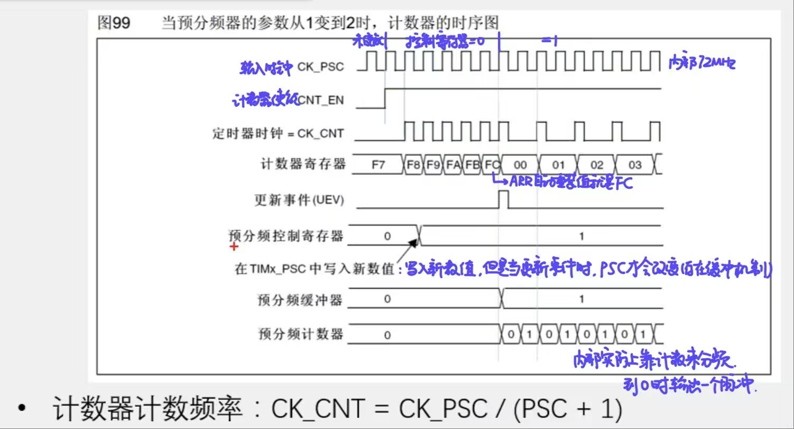
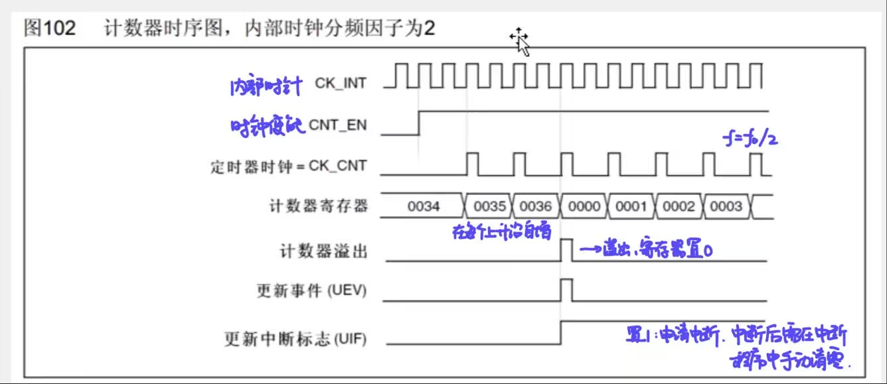

# 笔记：
## 1. 定时器TIM类型(包含关系。高级>通用>基本)

- 高级定时器：TIM1,8
- 通用定时器：TIM2,3,4,5
- 基本定时器：TIM6,7

> 对STM32F103C8T6而言，有TIM1,2,3,4可使用（一个高级，三个通用）

---

## 2. 基本定时器：定时中断功能，主模式触发DAC功能

### 定时中断功能

- TIMxCLK：主频72MHz
- 时基单元：PSC，CNT，ARR
- 预分频器PSC：输出频率“切几刀” (PSC=1 -> 输出频率=72/2=36MHz -> 称为二分频)
  - 由于其是16位的，PSC最大为65535 (2^16-1)
- 计数器CNT：每来一个上升沿，CNT+1
  - 取值范围0-65535，可能发生正溢出进行循环
- 自动重装寄存器ARR：存储写入的计数目标
  - 更新中断：当计数值（不断自增）= 自动重装值（固定），并且下一个时钟来临时，清零CNT，开始下一阶段的计时（向上计数模式）

### 主模式触发DAC功能

- 更新事件通过主模式映射到TRGO，从而触发DAC，不需要依赖中断触发，实现了硬件自动化

---

## 3. 通用定时器（增加了内外时钟源选择，输入捕获，输出比较，编码器接口，主从触发模式）

- 核心还是时基单元
- 向下计数模式：从重装值开始向下自减，减到0恢复为重装值，同时申请中断
- 中央对齐模式：从0开始，向上自增至重装值，申请中断；再向下自减到重装值，再申请中断；再循环
- 内外时钟源选择：不止可以选内部的72MHz时钟，还可以选外部（这个不太重要，现代控制一般都用内部时钟）
- 主模式输出：把定时器内部部分事件映射到TRGO中，用于触发其他定时器，DAC，ADC

---

## 4. 高级定时器（增加了重复计数器，死区生成，互补输出，刹车输入）

- 重复次数计数器：实现每隔几个计数周期才发生一个更新事件与事件中断（对更新信号进行分频）
- 死区生成电路DTG，互补输出：为了驱动三相无刷电机（在开关切换瞬间，产生一定时长的死区，防止出现直通现象）
- 刹车输入：给电机驱动提供安全保障

---
## 时基单元的时序理解：计数器时序
### 预分频器参数改变时的计数器时序（预装时序机制/影子寄存器）

### 计数器时序

- 是否预装时序可以自己设置。ARPE=0则无预装时序，ARPE=1则有
- 无预装时序，更新的新值（ARR,PSC）会马上生效。有预装则会等到下一个更新事件开始时生效

# 实验内容：使显示器每秒变量+1
## 参数：
- PSC= 7200-1 使定时器频率为72MHz/7200=10kHz
- ARR= 10000-1 使循环周期为0-9999。每1/10000秒更新一次数，故每一秒发生一次中断事件
- 中断函数已封装在Timer.c文件中

## 实验视频（bilibili）
- [3-1 定时器实现每秒数字加1](https://www.bilibili.com/video/BV1E9RvBvESd?vd_source=70fda1a733a6bced05721875006f85cd)