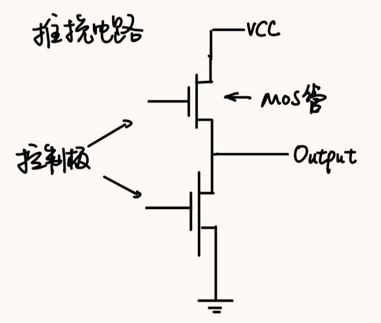
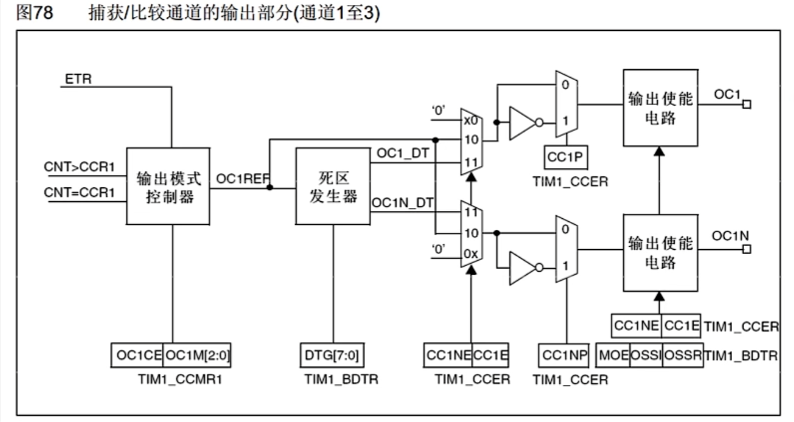

# 笔记
## 输出比较OC
### 定义
> 输出比较可以通过比较CNT与CCR寄存器的值，来对输出电平：置1、置0、翻转
- CNT是时基单元里面的计数器，CCR称为捕获/比较寄存器，是我们给定的值。
- 可以用于输出给定频率，占空比的PWM波
- 每个高级定时器，通用定时器都拥有4个输出比较通道，其中高级定时器前三个通道额外拥有死区生成，互补输出功能。
### PWM波
> 脉冲宽度调制
- 频率足够高时，可以等效获得所需的模拟参量。
   > 比如点灯的时候，灯在频率足够高时不再闪烁，而是亮度正比于PWM的占空比；电机调速也是同理。转速正比于PWM的占空比
- 应用场景必须是一个惯性系统。
   > LED灯的余晖现象，电机旋转的惯性
- 频率：1 / $T_{s}$
- 占空比：$T_{on}$ / $T_{s}$
- 分辨率：占空比变化步距
   > 1%分辨率：占空比只能为1%，2%，3%......（离散精细程度） 

   > 主要是因为CNT本身自增过程也是离散的，只能取到整数值

### 输出比较模式（8种）->输出模式控制器逻辑
- 冻结：CNT=CCR，此时REF保持为原状态
- 匹配时置有效电平：CNT=CCR时，REF置有效电平
- 匹配时置无效电平：CNT=CCR时，REF置无效电平
- 匹配时电平翻转：CNT=CCR时，REF电平翻转
   > 可以输出一个频率可调，占空比始终为50%的PWM波（高低电平各持续一个定时器周期，CCR实际上是在控制翻转时机而非占空比）
- 强制为无效电平：CNT与CCR无效，REF强制为无效电平
- 强制为有效电平：CNT与CCR无效，REF强制为有效电平
- PWM模式1：

| 计数模式 | 有效 | 无效|
|:---:|:---:|:---:|
|向上计数| CNT<CCR | CNT>=CCR |
|向下计数| CNT<=CCR | CNT>CCR |

- PWM模式2

| 计数模式 | 无效 | 有效|
|:---:|:---:|:---:|
|向上计数| CNT<CCR | CNT>=CCR |
|向下计数| CNT<=CCR | CNT>CCR |

## PWM模块基本结构
- 时基单元配置->输出比较单元（CCR->输出模式控制器->（得到REF）-> 极性选择，输出使能 ）-> GPIO口

## PWM参数计算
> 以PWM1,向上计数为例
- 频率：等于计数器的更新频率
- 占空比：Duty = CCR / ( ARR + 1 )
- 分辨率：Reso = 1 / ( ARR + 1 )

## 高级定时器的输出比较电路
### 输出比较电路后接的外部电路

- 控制极：比如给高电平就导通，低电平关闭
- 推挽输出：上管导通，下管断开 -> 高电平 ；低电平同理
- 不允许上下管均导通（电源短路）。上下管均断开：输出为高阻态模式
> 2个推挽=H桥电路(控制直流电机正反转)

> 3个推挽可用于驱动三相无刷电机

### 输出比较电路

- 互补输出OC1,OC1N: 两个互补输出端口，输出相反的电平
- 死区发生器：切换上下管导通状态时，难免会出现短暂的两管同时导通的情况，增加功耗。死区生成电路的功能是一个管关闭后延迟一小段时间再导通另一个管

## PWM常用外设
### 舵机
- 根据PWM信号占空比控制输出角度（当做通信协议而不是模拟输出）
- 要求：T=20ms，（f=50Hz）,高电平宽度0.5ms-2.5ms

输出信号脉冲宽度|占空比|舵机输出轴转角
:--:|:---:|:---:
0.5ms|2.5%|-90°
1ms|5%|-45°
1.5ms|7.5%|0°
2ms|10%|45°
2.5ms|12.5%|90°

### 直流电机
- 基本原理：电极正接，电机正转；电极反接，电机反转
- 属于大功率器件，GPIO无法直接驱动，可以外挂TB6612，L289N之类的电机驱动电路
- TB6612：一款双路H桥型直流电机驱动芯片

