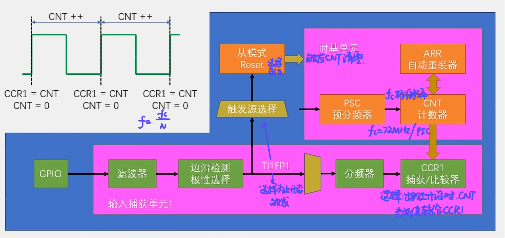
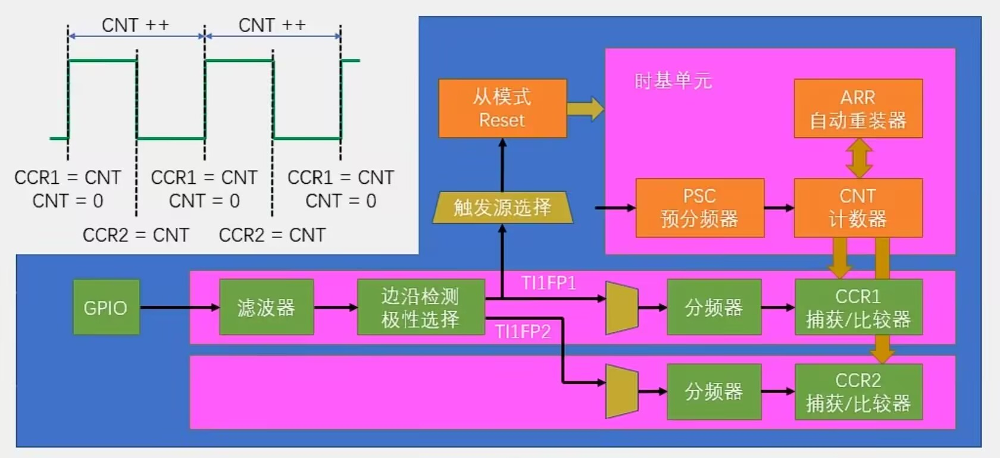

## 输入捕获（IC）
### 定义
- 当通道输入引脚出现指定电平跳变时，当前CNT的值被锁存进入CCR寄存器
- 可用于测量PWM波形频率，占空比。
### 配置
- 每个高级定时器和通用定时器都拥有4个输入捕获通道
- PWMI模式：可以同时测量频率，占空比
- 主从触发模式：硬件全自动测量

## 测量频率
### 测频法（适合高频）
- 在特定时间（闸门时间 T ）内，出现了多少个上升沿。$f_{x}$ = N / T
- STM32实现：N可以用定时器计次的方法（每来一个上升沿，计数+1），T可以用另一个定时器，定1s的定时中断即可。
### 测周法（适合低频）
- 在连续的两个上升沿之间，测量其经过的时间。经过的时间用已知的标准频率$f_{c}$计数为N次。 $f_{x}$ = $f_{c}$ / N
- STM32实现：主从触发模式自动触发：遇到下一个上升沿时CNT自动归零，实现硬件自动化
### 中界频率
- 低于$f_{m}$适合测周法，反之适合测频法
- $f_{m}$ = $\sqrt{f_{c} / T}$

## 主从触发模式（主模式，从模式，触发源选择）
### 主模式
- 定义：可以将定时器内部的信号，映射到TRGO引脚，用于触发别的外设
### 从模式
- 定义：接收其他外设（或自身外设）的信号，用于控制自身定时器运行
### 触发源选择
- 定义：选择从模式的触发信号源
- 选择指定的一个信号，得到TRGI，去触发从模式

## 输入捕获基本结构

- 注意CNT有上限，不能超过65535.信号频率过低的话CNT需要考虑溢出风险
- 从模式自动清零CNT只能选择CH1,2，另外俩无法通过触发源选择配置给从模式

## PWMI基本结构

- TI1FP2配置为下降沿触发，测量高电平脉冲宽度
- 占空比 = CCR2 / CCR1