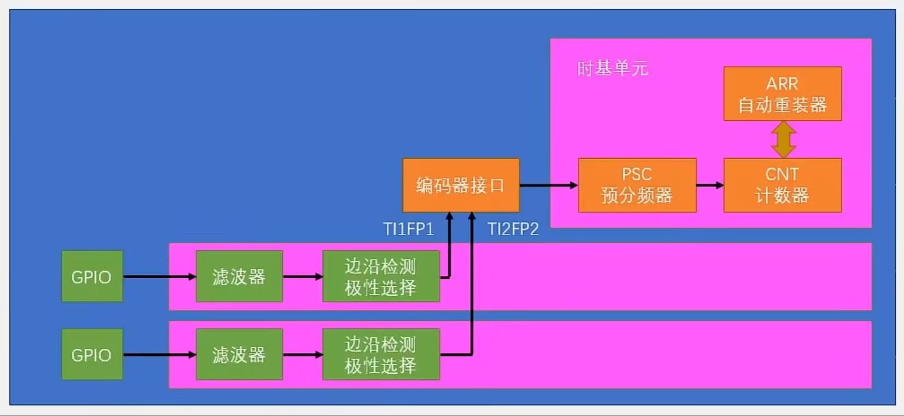
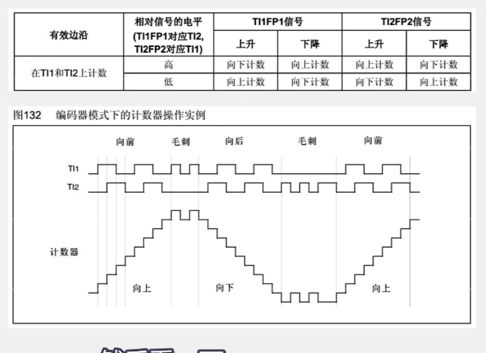

## 编码器接口（Encoder_Interface）
### 简介
- 作用：利用编码器测量电机速度，走向PID闭环控制
- 工作流程：根据编码器旋转产生的正交信号脉冲，自动控制CNT自增或自减，从而指示编码器的位置，旋转方向和旋转速度（带方向判断的双路外部时钟）
- 每个高级/通用定时器都有一个编码器接口
- 两个输入引脚借用了输入捕获IC的CH1，CH2

### 编码器测速原理
- 在正交编码器中，我们可以读到A,B两相的两个正交信号（频率相同，相位差90°）。
- 频率：任取一个信号测频
- 转向：是相对的概念，根据A相位超前or滞后B相位90°决定

### 内部结构实现

- TI1FP1,TI2FP2接入编码器的A,B两相
- 编码器接口通过PSC控制CNT
- ARR一般设置为最大值。通过强制类型转换，利用补码特性得到负数（eg.当CNT自减1时，更新为65536-1，强转为16位有符号数得到-1）
- 极性选择模块：指的是高低电平的极性选择，选择要不要加一个非门，把极性反转
- 单独改变一个接口的极性，计数方向反转，可以较为方便的调整计数方向。

### 工作状态
- TI1FP1对应TI2,TI2FP2对应TI1
- 计数：正转向上计数，CNT自增；反转CNT自减
- 三种工作状态：
- 仅在TI1计数：仅在B相的上升沿和下降沿计数
- 仅在TI2计数：仅在A相的上升沿和下降沿计数
- TI1、TI2都计数：两相的上升沿和下降沿都执行计数 -> 精度最高，最常用

### 实例

- 抗噪声原理：在毛刺信号段，由于TI2不变，计数器随着TI1的毛刺信号段上下摆动，有效的避免了毛刺信号的干扰

## 实验：测速旋转编码器
### 测速原理
- 每调用一次GetCount函数，CNT清零，利用delay控制计数周期，CNT表示在这段时间的编码器计数值，两者相除得到旋转编码器速度
- 现象：[旋转编码器测速实验（Bilibili外链）](https://www.bilibili.com/video/BV1sfLq6pEwd?vd_source=70fda1a733a6bced05721875006f85cd)