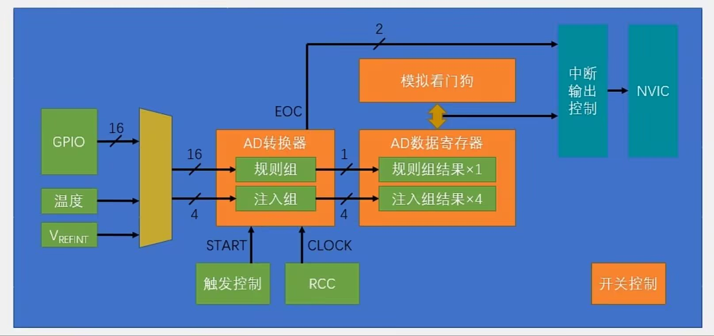

## 笔记
### ADC简介
- 模拟-数字转换器
- ADC可以把引脚中连续变化的模拟电压转换为数字变量，联系模拟电路与数字电路
- 工作模式：逐次逼近型（运用DAC进行二分法逼近）
- 12位AD值：指量化结果为0 ~ $2^{12}-1$ （0~4095）
- 1us转换时间：从AD转换开始，到产生结果需要的时间
- 输入电压范围：0 ~ 3.3V (与量化输出结果线性对应)
- 输入通道：16个外部（GPIO口）+2个内部信号源
- STM32增强功能：规则组和注入组
### STM32实现

- 规则组最多选中16个通道，注入组4个
- 触发控制：软件触发 / 硬件触发（定时器/外部中断）
- 模拟看门狗：超出设定阈值则向NVIC申请中断
- EOC信号也会通向中断
- 开关控制：ADC_Cmd函数
### ADC的转换模式
- 单次转换，非扫描模式：ADC序列中，只有序列1有效。在序列1中输入通道，触发后，ADC就会对该通道完成数模转换，转换完成后EOC标志位置1，结果存储在数据寄存器中，转换停止，等待下一次触发指令。
- 单次转换/连续转换：转换是否会自动停止？连续转换会一直持续下去。
- 非扫描模式/扫描模式：是否只有序列1有效？扫描模式下，指定通道数目为x，则ADC对序列 1 ~ x 发起转换
### 数据对齐
- 右对齐：数据寄存器存储转换结果时，在前面补零（常用，读出来无需处理就是结果）

## 实验
- 电位器：类似一个可调电阻，用螺丝刀旋转旋钮，可以连续调节中间连到A0口的电位
- 实验现象：[ADC-AD单通道(bilibili)](https://www.bilibili.com/video/BV1tuLq6dEZF?vd_source=70fda1a733a6bced05721875006f85cd)