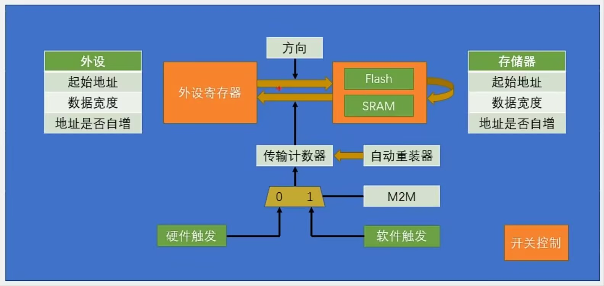

## 笔记
### DMA简介
- Direct Memory Assess 直接存储器存取
- 提供高速数据传输：外设-存储器 存储器-存储器 （用硬件节约CPU软件的性能占用）
- 12个通道：DMA1:7个；DMA2:5个
- 通道支持软件触发，特定的硬件触发

### 存储器映像
- ROM

|起始地址 | 存储器 | 用途 |
|:---:|:---:|:---:|
| 0x0800 0000| 程序存储器Flash | 存储编译后的程序代码 |
0x1FFF F000 | 系统存储器 | 存储BootLoader,用于串口下载
0x1FFF F800 | 选项字节 | 存储独立于程序代码的配置参数

- RAM

|起始地址 | 存储器 | 用途 |
|:---:|:---:|:---:|
| 0x2000 0000| 运行内存SRAM | 存储运行过程中的临时变量 |
0x4000 0000 | 外设寄存器 | 存储外设的配置参数
0xE000 0000 | 内核外设寄存器 | 存储内核外设的配置参数

### DMA基本结构

- 方向可以控制 外设->存储器 / 存储器->外设
- 存储器->存储器: Flash -> SRAM / SRAM -> SRAM （Flash只读）

## 实验
