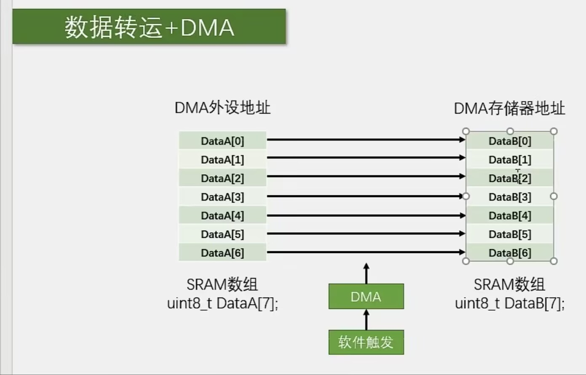
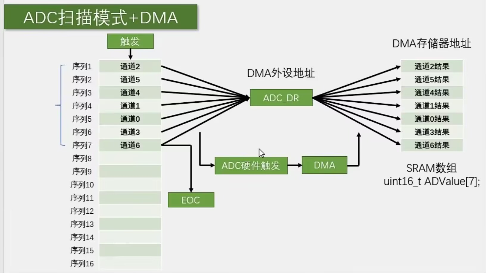

## 笔记
### DMA简介
- Direct Memory Assess 直接存储器存取
- 提供高速数据传输：外设-存储器 存储器-存储器 （用硬件节约CPU软件的性能占用）
- 12个通道：DMA1:7个；DMA2:5个
- 通道支持软件触发，特定的硬件触发

### 存储器映像
- ROM

|起始地址 | 存储器 | 用途 |
|:---:|:---:|:---:|
| 0x0800 0000| 程序存储器Flash | 存储编译后的程序代码 |
0x1FFF F000 | 系统存储器 | 存储BootLoader,用于串口下载
0x1FFF F800 | 选项字节 | 存储独立于程序代码的配置参数

- RAM

|起始地址 | 存储器 | 用途 |
|:---:|:---:|:---:|
| 0x2000 0000| 运行内存SRAM | 存储运行过程中的临时变量 |
0x4000 0000 | 外设寄存器 | 存储外设的配置参数
0xE000 0000 | 内核外设寄存器 | 存储内核外设的配置参数

### DMA基本结构

- 方向可以控制 外设->存储器 / 存储器->外设
- 存储器->存储器: Flash -> SRAM / SRAM -> SRAM （Flash只读）
- 起始地址：决定数据的来源和去向
- 数据宽度：转运的数据的字位
- 地址是否自增：下次转运是否要换地址（读取地址&存储地址）
- 传输计数器：指定总共转运的次数n（是一个自减计数器），当计数器减到0时，外设和存储器回到起始地址，方便进行下一轮转运。
- 注意：写传输计数器时，必须先关闭DMA_Cmd，再写入
- 自动重装器：开启时，当传输计数器自减至0之后，会把值重装为n，开启新一轮循环。
- M2M控制DMA触发模式。M2M=1为软件，=0为硬件
- 自动重装和软件触发不可以同时使用，会导致无限循环

### 转运思路
#### DMA数据转运

- 起始地址：DataA,DataB数组起始地址
- 图中情况对应两个地址都自增
#### ADC扫描+DMA

- 扫描AD转换之后，转换结果都放在ADC_DR寄存器中
- 目标：每个通道转换完成后，转运ADC_DR到ADValue数组，目的地址自增
- ADC扫描模式很刚需DMA帮忙转运

## 实验
- DMA数据转运:尝试把DataA里面的数据转运到DataB中
- 实验循环：一秒自增DataA的数据，一秒转运到DataB中
- 实验现象：[DMA数据转运(bilibili)](https://www.bilibili.com/video/BV1pyLS6nE8S?vd_source=70fda1a733a6bced05721875006f85cd)